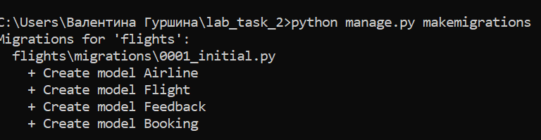
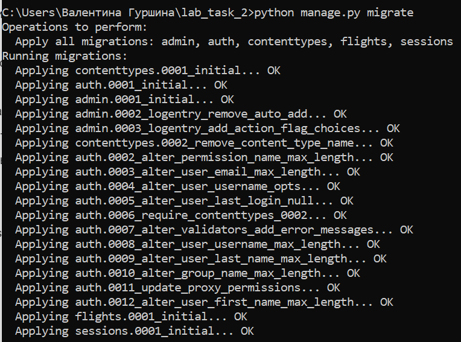
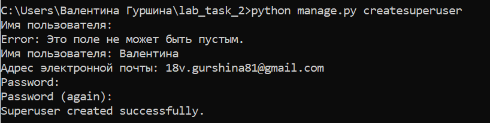

Документация по лабораторной работе №2:

Создаем супер пользователя (админа):

В модели РЕЙСов определен внешний ключ к таблице авиакомпаний (related_name - flights). Имя позволяет обращаться к объектам/атрибутам рейсов из модели авиакомпании. 
Значения "отлет" и "прилет" хранятся в бд и видны пользователю во время использования страницы. 

В модели БРОНИРОВАНИЕ добавлены два внешних ключа: (1) на User со встроенной моделью для хранения пользователей и(2) Flight (рейс). Для обоих полей действует related_name="bookings". Для подтверждения брони администратором "Заригистрирован ли пользователь в системе?" bool'евое поле, "Номер брони" со значением от 0 до 32000+, которые вводятся администратором. 

Панель администратора устанавливается в соответствии с логикой сервиса. В администрировании авиакомпании использован 
метод .count() для атрибута flights, чтобы узнать количество объектов в запросе. Название этого метода поместили в list_display для отображения этого количества в таблице для каждой авиакомпании.
Определен метод get_flights, вводимый в readonly_fields. В этом методе проходим по всем рейсам для сбора информации о каждом из них, чтобы вывести её в инфо поле авиакомпаний.

Необходимы ссылки на инфо поля соответствующих рейсов. Для этого вызовем функцию django.urls.reverse(), первым аргументом которой будет ссылка на изменение объекта в панели администратора.
Каждая строка помещена в список и объединена с помощью метода .join, где тэг   - разделитель. С помощью функции mark_safe текст отмечен как неопасный, поскольку Django по умолчанию избегает HTML тэгов.

По тому же принципу, что преследовался с авиакомпаниями и списком рейсов, создается метод get_bookings для получения списка всех броней на рейс. 

ФОРМА АВТОРИЗАЦИИ И РЕГИСТРАЦИИ 
Создадим форму регистрации/авторизации новых пользователей на основе сущесвующей встроенной в Django. 
Задействуем 3 основных поля: никнейм, пароль и подтверждение пароля. Запишем все в новый класс. 

Используем и переопределим метод save. В начале вызовем метод save и пометим его как commit=False, чтобы не отправлять запрос в базу данных. Получим из словаря cleaned_data (данные, прошедшие валидации) значения новых полей и присвоим их атрибутам нового объекта. Сохраним объект и вернём его.

Выполненные задания с leetcode: 
