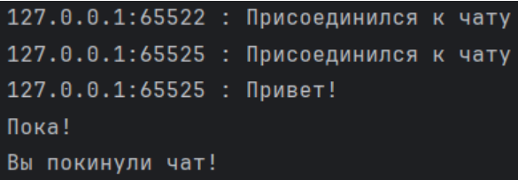

Задание: Реализовать многопользовательский чат.

Требования:

Обязательно использовать библиотеку socket.
Реализовать с помощью протокола TCP – 100% баллов, с помощью UDP – 80%.
Обязательно использовать библиотеку threading.

1. Когда клиент подключается, сервер принимает соединение с помощью server.accept().
2. Для каждого клиента создаётся новый поток (HandlerThread), который будет обрабатывать его сообщения.
3. В каждом потоке приём сообщений от клиента с помощью recv(). Полученные сообщения рассылаются всем подключённым клиентам, кроме отправителя, с помощью conn.sock.send().
4. Когда клиент отключается (таймауту или закрытие соединения), сервер уведомляет других клиентов и закрывает соединение с этим клиентом.

