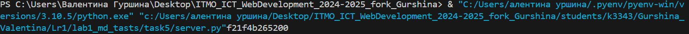

Задание:
Написать простой веб-сервер для обработки GET и POST HTTP-запросов с помощью библиотеки socket в Python.

Для отображения Post запроса: http://127.0.0.1:8080/

Основной цикл сервера: 

```
with socket.socket(socket.AF_INET, socket.SOCK_STREAM) as server_socket:
    server_socket.bind((SERVER_HOST, SERVER_PORT))
    server_socket.listen()
    print(f"Запуск сервера на порту {SERVER_PORT}")
    while True:
        client_socket, client_address = server_socket.accept()
        client_thread = threading.Thread(target=process_client_request, args=(client_socket, client_address))
        client_thread.start()

```


Генерация HTML страницы: 

```

def generate_html():
    rows = ''.join([f"<tr><td>{discipline}</td><td>{','.join(grades)}</td></tr>" for discipline, grades in grades_data.items()])
    return f"""<!DOCTYPE html>
<html>
<head>
    <title>Отметки</title>
</head>
<body>
    <h1>Отметки</h1>
    <table border="1">
        <tr><th>Дисциплина</th><th>Отметки</th></tr>
        {rows}
    </table>
</body>
</html>"""

```
1. Сначала создается сокет для сервера, который будет слушать на порту 8080.
2. Когда клиент подключается, создается новый поток, чтобы параллельно обрабатывать запросы, не блокируя основной процесс.
3. GET-запросы приводят к отправке HTML-страницы с таблицей дисциплин и оценок.
4. POST-запросы позволяют отправлять данные (оценки по дисциплинам), которые сохраняются на сервере в словаре grades_data.
5. Для каждого запроса создается новый поток, чтобы сервер мог обрабатывать несколько запросов одновременно.